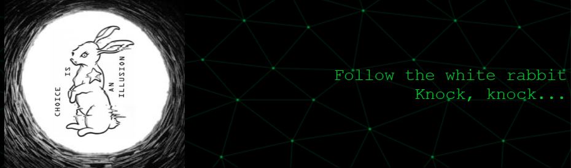

## 😎 About Me

I'm a software developer based in Sao Paulo, Brazil. I thrive on tackling complex problems and creating efficient solutions. I am currently focused on enhancing my skills in Go, ReactJS, and NextJS while exploring new technologies.
- 🌱 I’m currently learning **Go, Data Structures & Algorithms, ReactJS, NextJS**

- 👯 I’m looking to collaborate on **Blockchain Projects**

- 🤝 I’m looking for help with **| Cryptography | Zero-Knowledge-Proof | Bug-Bounty**

- 💬 Ask me about **| Go | Decentralized-Technologies | Blockchain**

- 📫 How to reach me **vhugocfdev@gmail.com**

- 📄 Know about my experiences [https://linkedin/in/vhugocf](https://linkedin.com/in/vhugocf)

## 🌎 Connect With Me

  
  
  

## 💻 Skills & Technologies

  

## 📊 GitHub Stats

  
  
  

## 👨🏻‍💻 My Projects
  

- [FullstackCourse-University-of-Helsinki-2020](https://github.com/vhugocf/FullstackCourse-University-of-Helsinki-2020) - Completed coursework from the University of Helsinki's Full Stack course. ⭐ 0 Stars | Language: JavaScript | Forks: 0 | Open Issues: 0

- [hello-api](https://github.com/vhugocf/hello-api) - A simple API built with Go. ⭐ 0 Stars | Language: N/A | Forks: 0 | Open Issues: 0

  

<!--
is not important
-->
