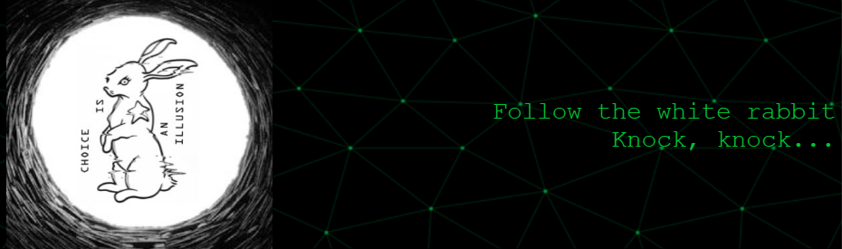

<!-- -->

# About Me <👨‍💻> 
> I am a software engineer based in São Paulo, Brazil, dedicated to tackling complex problems and delivering efficient solutions. Currently, I am sharpening my expertise in Go and Python, while strategically exploring cutting-edge technologies that leverage artificial intelligence to optimize the development of secure, high-quality code. I am driven to excel in my field and make a significant impact in the industry
[][github-profile]

- 🌱 I’m currently learning **Go, Python, Agentic-Code, Data-Structures & Algorithms, Zero-Knowledge Proof, Cryptography, and Artificial Intelligence(ML, DL, LLMs)**

- 👯 I’m looking to collaborate on **Autonomous software engineering in testing, legacy refactoring, and security by using AI agents to write tests, modernize outdated codebases, and identify vulnerabilities**

- 💬 Ask me about **Agentic Code | Artificial Intelligence | Large-Language-Models | Distributed Systems | Open-Source Software**

[][github-profile]

# My Stats <📊>

[][github-profile]

# Connect With Me <✉️>

[][linkedin]&emsp;
[][x]

# Skills & Technologies <💻>

  

# My Projects <👨🏻‍💻> 
  
- [Slot-Machine-GO](https://github.com/vhugocf/go-project-slotmachine) - A slot machine made in GO. | Language: Go

- [Inventory-TUI](https://github.com/vhugocf/go-inventory-tui) - An inventory system made in GO with TUI.  | Language: Go 

- [FullstackCourse-University-of-Helsinki-2020](https://github.com/vhugocf/FullstackCourse-University-of-Helsinki-2020) - Completed coursework from the University of Helsinki's Full Stack course. | Language: JavaScript

<!-- COUNTER -->

  

<!-- GITHUB PROFILE AND REFERENCES -->
[github-profile]: https://github.com/vhugocf
[linkedin]: https://www.linkedin.com/in/vhugocf
[x]: https://x.com/vhugocf

