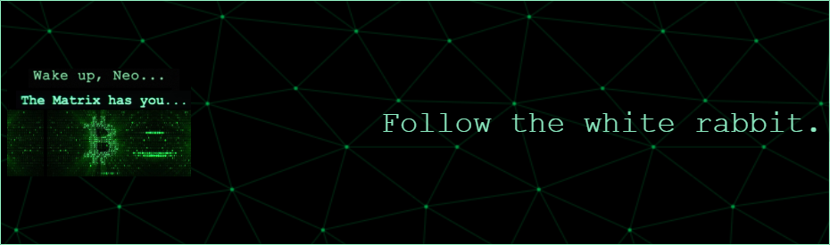

## 😎 About Me

I'm a software developer based in Sao Paulo, Brazil. I thrive on tackling complex problems and creating efficient solutions. I am currently focused on enhancing my skills in Go, ReactJS, and NextJS while exploring new technologies.
- 🌱 I’m currently learning **Go, Data Structures & Algorithms, ReactJS, NextJS**

- 👯 I’m looking to collaborate on **Blockchain Projects**

- 🤝 I’m looking for help with **a**

- 💬 Ask me about **Go, Economy**

- 📫 How to reach me **vhugocfdev@gmail.com**

- 📄 Know about my experiences [https://linkedin/in/vhugocf](https://linkedin.com/in/vhugocf)

## 🌎 Connect With Me (𝕏)

## 💻 Skills & Technologies

  

## 📊 GitHub Stats

  
  

## 👨🏻‍💻 Top Projects

- [vhugocf](https://github.com/vhugocf/vhugocf) - My personal project showcasing my skills and projects. ⭐ 0 Stars | Language: N/A | Forks: 0 | Open Issues: 0
- [hello-api](https://github.com/vhugocf/hello-api) - A simple API built with Go. ⭐ 0 Stars | Language: N/A | Forks: 0 | Open Issues: 0
- [setup-nodejs](https://github.com/vhugocf/setup-nodejs) - Node.js setup with Docker and GitHub Actions. ⭐ 0 Stars | Language: N/A | Forks: 0 | Open Issues: 0
- [github-slideshow](https://github.com/vhugocf/github-slideshow) - A robot powered training repository. ⭐ 0 Stars | Language: Ruby | Forks: 0 | Open Issues: 0
- [FullstackCourse-University-of-Helsinki-2020](https://github.com/vhugocf/FullstackCourse-University-of-Helsinki-2020) - Completed coursework from the University of Helsinki's Full Stack course. ⭐ 0 Stars | Language: JavaScript | Forks: 0 | Open Issues: 0

  

<!--
**vhugocf/vhugocf** is a ✨ _special_ ✨ repository because its `README.md` (this file) appears on your GitHub profile.

<h3 align="center">As an engineer, I believe in the power of simplicity in software development. It takes hard work and a solid education to achieve, but I’m dedicated to advocating for it, even when complexity tends to overshadow it.</h3>

-->
